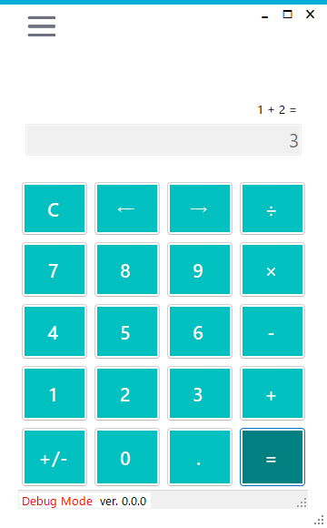
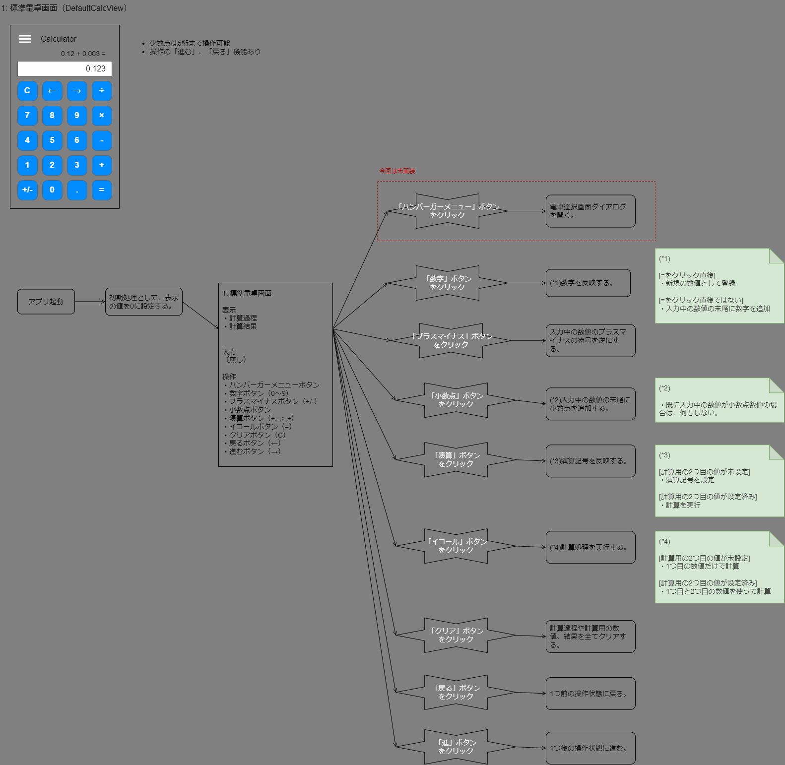
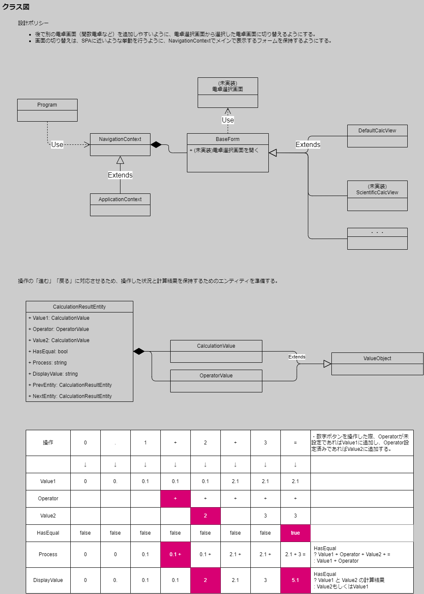

# calculator-winform-cs

電卓アプリです。



## 機能

- 四則演算機能（+ - × ÷）
- 小数点は5桁まで操作可能
- 各操作のログ出力機能
  - デバッグ: コンソールに出力
  - リリース: Exeと同フォルダ内の`log.txt`に出力
- 操作の「進む」「戻る」機能有り

## 技術スタック

- WindowsForm
- MetroModernUI
- log4net

## ディレクトリ構成

```txt
+ apps/
|  |
|  + Calculator/                    : 電卓アプリ
|     + Calculator.Domain/          : 電卓アプリDomainレイヤー
|     + Calculator.WinForm/         : 電卓アプリViewレイヤー
|     |  |
|     |  + Views                    : View
|     |  + ViewModels               : ViewとModel(Domain)間の伝達や情報保持を担当するViewModel
|     |
|     + CalculatorTest.Tests/       : テストコード
|     + Calculator.sln              : Visual Studio ソリューションファイル 
|
+ docs/
|  |
|  + design/                        : 設計資料
|  + git-rule.md                    : gitルール
|  + todo.md                        : タスクメモ
|
```

## 電卓機能追加について

- 別の電卓画面（例えば関数電卓）を追加する場合、画面遷移は左上のハンバーガーメニューからコンテキストメニューを開き、別の電卓画面を選択するように改修する。
- 別の電卓画面は、BaseFormを継承した画面とし、NavigationContextに継承された画面を格納可能とする事で画面遷移を容易にする。




